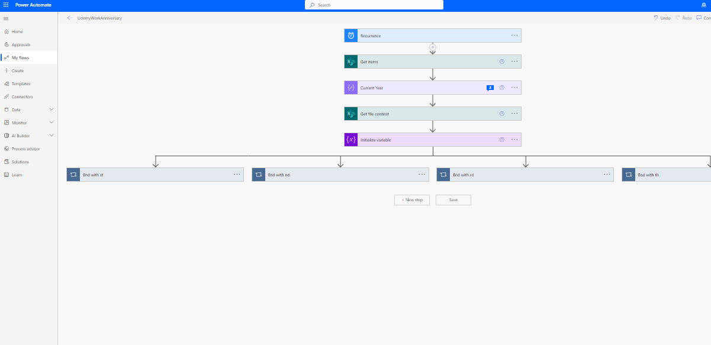

# Automating Employees Work Anniversary Celebration (Power Automate)
## Introduction
Work Anniversaries are special days that are not just important to you but to the organization as well.
It marks the day an employee joined an organization. Sending out a customize message celebrating it, shows that the company/organization remembers/cares about the employee on that special day. It gives them a feeling of value and importance to the organization. It helps the organization stay closer to their employees, it creates a sense of belonging on the part of the employee. 
Sometimes this activity is done by one person, who has to check the calendar every day and keep track of whose work anniversary  it is, and send a composed email to whomever anniversary falls on that particular current day.
## Solutions Overview
We will be building a basic database at the back end where all the data are stored such as Excel, SharePoint list, and power automate will help check once every day, and the employee whose work anniversary is on that day is going to send that employee a precomposed customized message. This allows HR to care more for people and also improves employee morale which in turn would improve employee productivity.
## Some of the services used are,
- SharePoint List, to store the data.
- Power Automate as a frontend
- MS Outlook for sending mail.
## Power Automate Flow Overview

